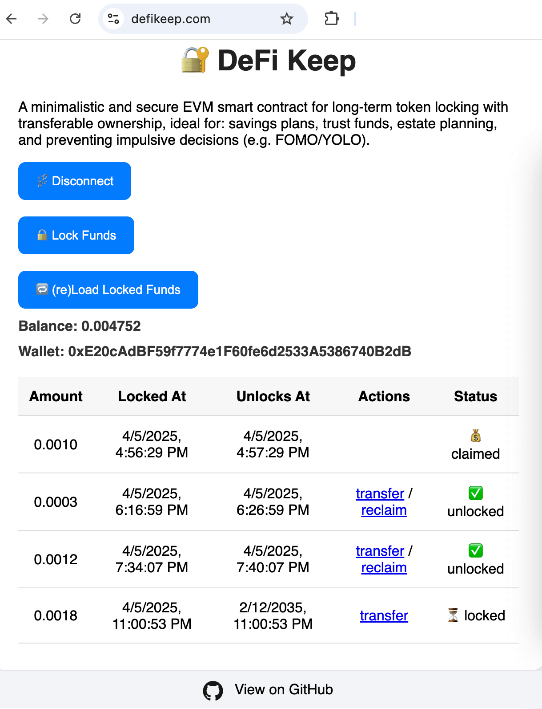

# 🔐⏳📈 DeFi Keep (Growing)!

[**DeFiKeep**(.com)](https://defikeep.com) is a minimalistic, secure EVM smart contract for locking native tokens over long periods of time. 
 
Users can designate a reclaim address and specify a duration after which the funds can be withdrawn.

Perfect for long-term holders, inheritance planning, or crypto time capsules.

# 🔥 Motivation
According to many studies [[1]](https://www.etoro.com/news-and-analysis/press-releases/short-term-fling-or-long-term-love-analysis-shows-commitment-pays-off-when-it-comes-to-investing/)[[2]](https://www.bluewealth.com.au/general-knowledge/the-best-performing-investors-are-ones-that-are-dead/), most investors underperform the very assets they invest in, and the average investor earns significantly less than the market average, often due to emotional decisions like panic selling, FOMO buying, or trying to time the market.

In crypto, it is even more dramatic:

* 📉 80% of active crypto traders underperform HODLers.

* ⌛ Long-term holders (LTHs) of Bitcoin historically outperform short-term speculators over nearly every 4-year cycle.

* 💸 Many retail users sell too early or rotate into worse-performing assets due to short-term thinking.

That's why offering a simple, transparent, and enforceable way to HODL is not just useful, it is a valuable contribution to long-term investing discipline.


---

## 🧠 What It Does

DeFi Keep allows any user to:

- Lock the native token for a specified number of seconds.
- Assign a reclaim address to retrieve the funds after the unlock period.
- Update the reclaim address (_e.g._, if a wallet is compromised).
- View the remaining time and lock details.
- Support multiple locks per address, each with its own terms.

---

## 🔐 Features

- ✅ Time-based unlocks.
- ✅ Multiple locks per user.
- ✅ Reclaim address updatable by the current reclaim address.
- ✅ Reentrancy protection.
- ✅ Self-contained with no external dependencies.
- ✅ Minimalist design so it is easily understood and useful.


---

## ✨ Live deployment

This solution is live in a couple of main-nets as well as test-nets, and accessible on the following website: https://DeFiKeep.com


Fig. 1 - Screenshot showing a live example of funds being locked, claimed, and transferred.  


---

## 📝 Contract Details

- **Language**: Solidity `^0.8.20`
- **File**: [`DeFiKeep.sol`](./contract/DeFiKeep.sol)
- **License**: MIT
- **Status**: Beta — Use at your own risk!

## 📦 Contract Deployments

The DeFi Keep contract has been __deployed__ and __verified__ in the following chains/addresses:

### Mainnets:

- **RootStock**: [0x6Aef6B0B33a4f99Cdd4baC962700bF17b700B6b7](https://rootstock.blockscout.com/address/0x6Aef6B0B33a4f99Cdd4baC962700bF17b700B6b7?tab=contract)
- **Flow EVM**: [0x6Aef6B0B33a4f99Cdd4baC962700bF17b700B6b7](https://evm.flowscan.io/address/0x6Aef6B0B33a4f99Cdd4baC962700bF17b700B6b7?tab=contract)


### Testnets:
- **Citrea Testnet**: [0x18253170c3f5719e621cc65330135032cba33632](https://explorer.testnet.citrea.xyz/address/0x18253170c3f5719e621cc65330135032cba33632?tab=contract)
- **RootStock Testnet**: [0xbF31eC2eFBEeC6F5cfdbb3febc703BC1be0A8FE5](https://rootstock-testnet.blockscout.com/address/0xbF31eC2eFBEeC6F5cfdbb3febc703BC1be0A8FE5?tab=contract)
- **Flow EVM Testnet**: [0xB9F473490Fc5f6466C60137C4016e15E5330f10B](https://evm-testnet.flowscan.io/address/0xB9F473490Fc5f6466C60137C4016e15E5330f10B?tab=contract)


---
## 🚀 How to Use

DeFi Keep mainly consists of 3 operations: 1) lock funds, 2) reclaim funds, and 3) optionally transfer the lock ownership of locked funds to a new owner/address. 

### 🔐 Lock Native Token

Use the `lock` function to securely lock the native token for a specified period. Once locked, the funds cannot be reclaimed until the unlock time has passed.

```solidity
function lock(address reclaimAddress, uint256 timeInSeconds) external payable returns (uint256 lockId)
```

### 💰 Reclaim Locked Funds
Once the lock period has passed, the reclaim address can call this function to withdraw the locked funds.

```solidity
function reclaim(uint256 lockId) external
```

### 🛠 Update Reclaim Address

Use this function to change the reclaim address for a specific lock. This is useful if you want to transfer ownership to a new wallet (_e.g._ hardware wallet or cold storage).

```solidity
function updateReclaimAddress(uint256 lockId, address newAddress) external
```

---

## 👨‍💻 Author

António Roldão is the creator of DeFi Keep. António is an entrepreneur and a passionate technologist with a Ph.D. in Electronics and Computer Engineering from Imperial College London. Antonio’s career spans diverse fields, including aerospace, finance, and artificial intelligence. He is the co-founder and CEO of muse.ai, where he has pioneered advanced video search technology leveraging cutting-edge AI. Antonio combines deep technical expertise with a drive to create technologies that empower people and simplify complexity.